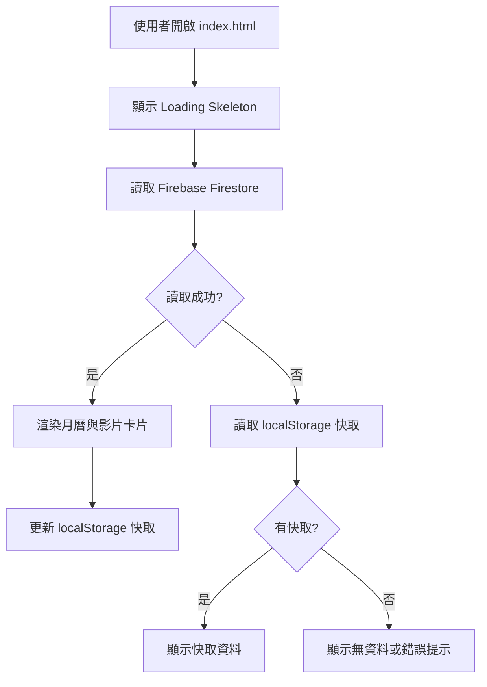
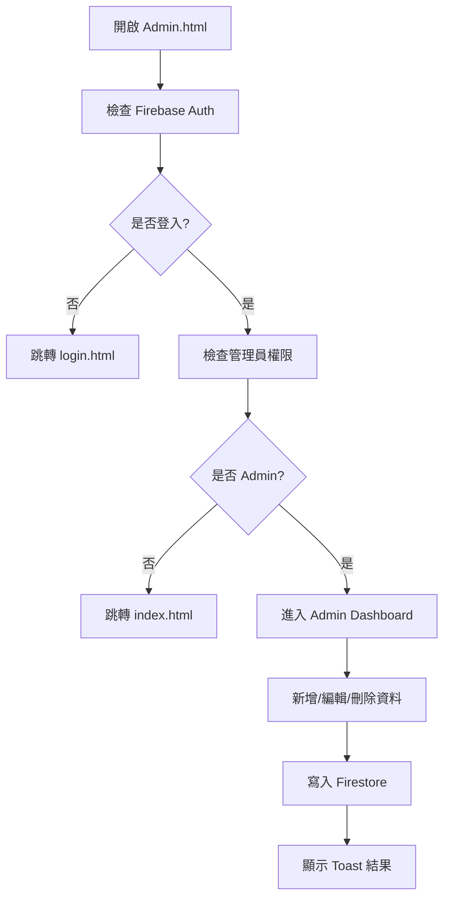
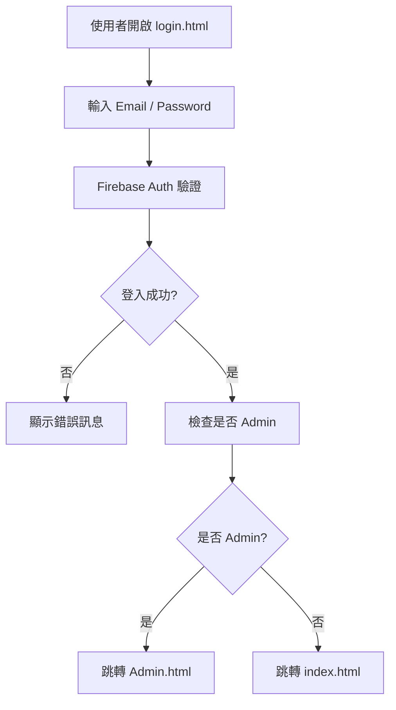
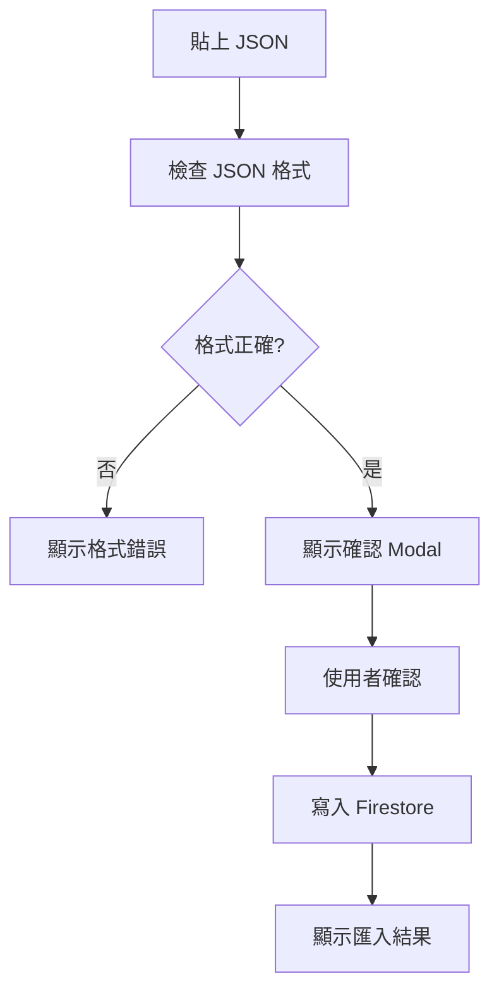
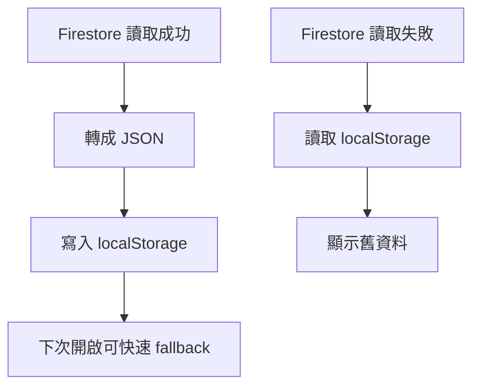

# System Flow
# study.cwli.dev 系統流程

## 前台資料流程

```mermaid
graph TD
A[使用者開啟 index.html] --> B[顯示 Loading Skeleton]
B --> C[讀取 Firebase Firestore]
C --> D{讀取成功?}
D -->|是| E[渲染月曆與影片卡片]
E --> F[更新 localStorage 快取]
D -->|否| G[讀取 localStorage 快取]
G --> H{有快取?}
H -->|是| I[顯示快取資料]
H -->|否| J[顯示無資料或錯誤提示]
```

---

## 後台權限流程

```mermaid
graph TD
A[開啟 Admin.html] --> B[檢查 Firebase Auth]
B --> C{是否登入?}
C -->|否| D[跳轉 login.html]
C -->|是| E[檢查管理員權限]
E --> F{是否 Admin?}
F -->|否| G[跳轉 index.html]
F -->|是| H[進入 Admin Dashboard]
H --> I[新增/編輯/刪除資料]
I --> J[寫入 Firestore]
J --> K[顯示 Toast 結果]
```

---

## 登入流程

```mermaid
graph TD
A[使用者開啟 login.html] --> B[輸入 Email / Password]
B --> C[Firebase Auth 驗證]
C --> D{登入成功?}
D -->|否| E[顯示錯誤訊息]
D -->|是| F[檢查是否 Admin]
F --> G{是否 Admin?}
G -->|是| H[跳轉 Admin.html]
G -->|否| I[跳轉 index.html]
```

---

## JSON 匯入流程

```mermaid
graph TD
A[貼上 JSON] --> B[檢查 JSON 格式]
B --> C{格式正確?}
C -->|否| D[顯示格式錯誤]
C -->|是| E[顯示確認 Modal]
E --> F[使用者確認]
F --> G[寫入 Firestore]
G --> H[顯示匯入結果]
```

---

## Cache 流程

```mermaid
graph TD
A[Firestore 讀取成功] --> B[轉成 JSON]
B --> C[寫入 localStorage]
C --> D[下次開啟可快速 fallback]

E[Firestore 讀取失敗] --> F[讀取 localStorage]
F --> G[顯示舊資料]
```
